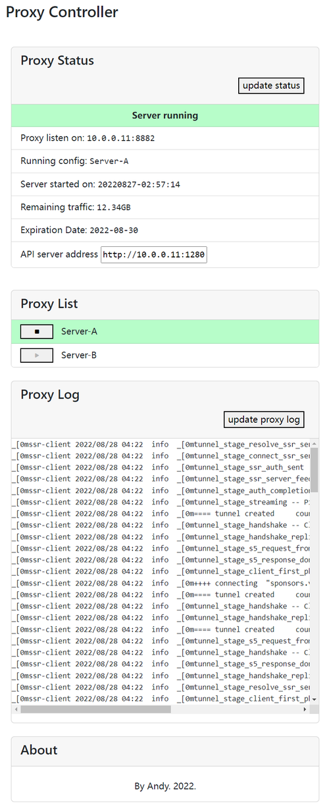

## README
I hope to control my proxy server with UI experience like [ShadowRocket](https://apps.apple.com/us/app/shadowrocket/id932747118) on my linux server. So I develop this scheduler.

This is a scheduler program controlling proxy clients. Based on python back-end and vue front-end.

For self-usage only.

### Python server
GOTO [python](python/)

### Web front-end
GOTO [web](web/)

## Screenshot
